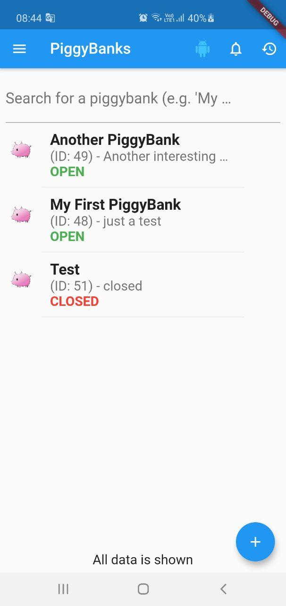
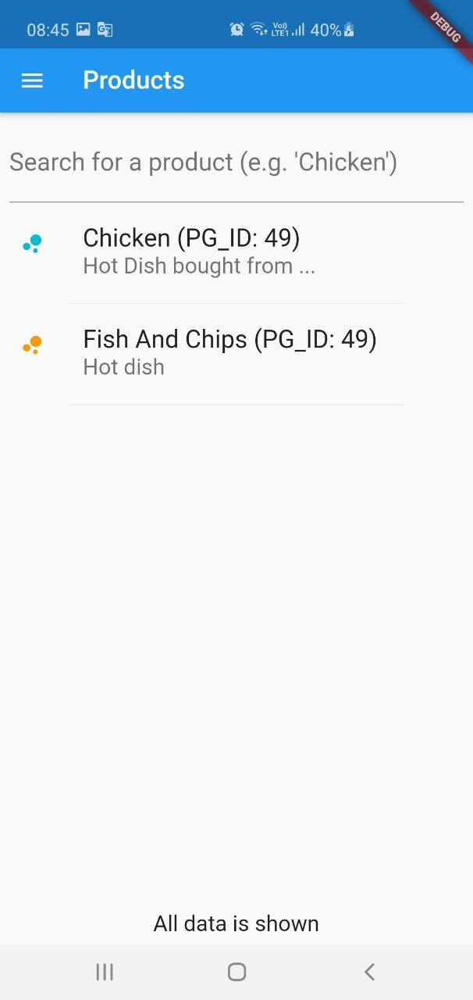

# CyberDindarolo Mobile App

*Disclaimer: This is a project with educational purposes only as it's the result of
"Mobile & Web Applications" class.*

A mobile application written with Flutter that implements the <a href="https://github.com/lorenzodeveloper/CyberDindarolo">CyberDindarolo API.</a>

This is only the frontend of the project.

For more information about how this project works, please see the CyberDindarolo API repo.

# Screenshots
 
  
 
 
  
 
 
 
 

# Author
- Lorenzo Fiorani
